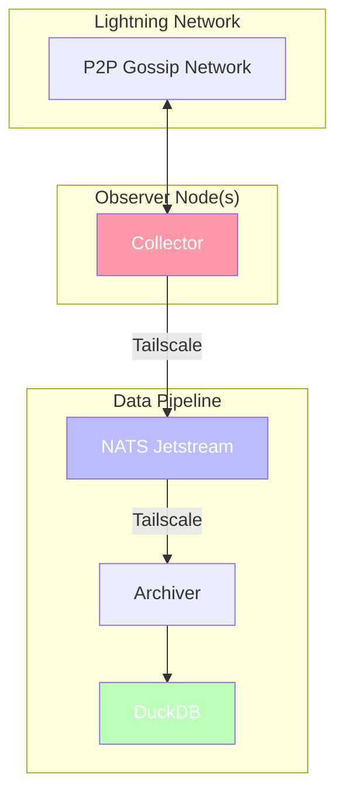
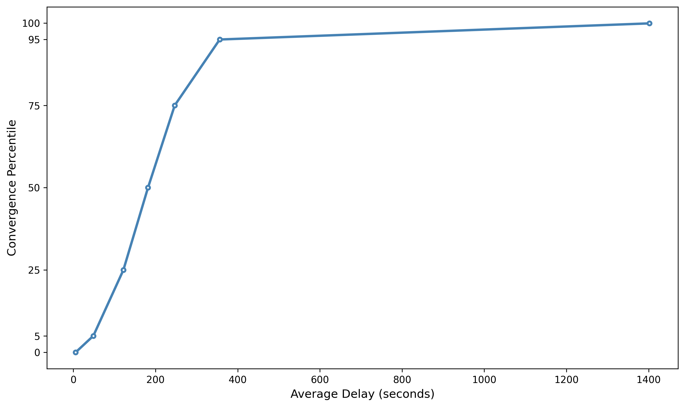
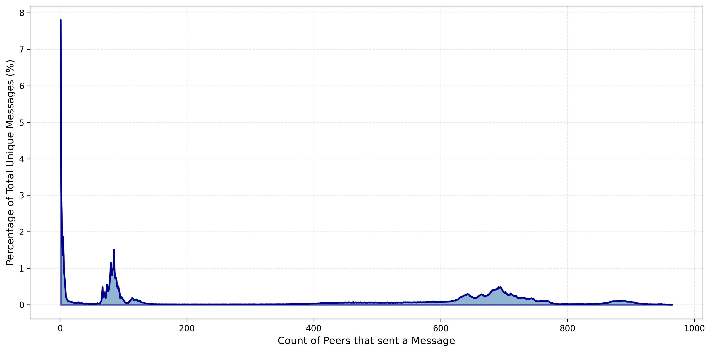
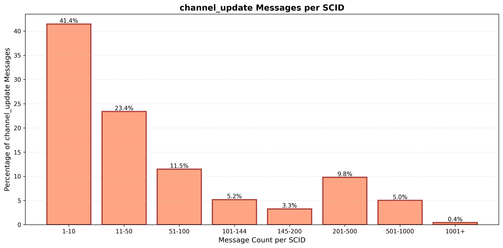

# Gossip Observer

A project to collect LN gossip traffic and compute useful metrics to inform a set-reconciliation based protocol (Erlay-like) to replace message flooding.

This project is inspired by [earlier work](https://arxiv.org/abs/2205.12737v1) on measuring properties of the LN gossip network, and [more recent work](https://endothermic.dev/p/magical-minisketch) on adapting Minisketch for LN gossip messages.

## Architecture



- The collector is a daemon that runs a forked version of ldk-node which does not forward gossip
(it should still reply to gossip queries). It collects to a random set of nodes, and then forwards
gossip messages to a NATS server. It runs for a fixed time period, set via config file.

- The archiver applies some basic config to an already-running NATS server, creates a DuckDB database
for storing gossip data from the collector, and batch wrties said data to the DB. The archiver MUST
be started before the collector.

- Tailscale is used as a P2P VPN here due to convinience; Nebula or vanilla Wireguard would also work.

- Once data is collected, the DuckDB built-in UI can be used to run queries:

```bash
# This will grow the DB file by ~5x, but should speed up queries.
./db_build_indices.sh $DB_FILENAME

# The DuckDB UI can be resource-hungry; add limits to not affect other processes.
systemd-run --scope -p MemoryMax=16G -p CPUQuota=50% --user duckdb -ui
```

## Layout

gossip_analyze/ - Small CLI, mostly used to fetch peer specifiers.

gossip_archiver/ - Explained above. Also runs an actix-web server but that is mostly used for debug.

gossip_collector/ - Explained above.

gossip_dump/ - Output dir for lists of node keys, channels, etc.

sql_queries.sql - SQL queries used in the DuckDB UI to analyze collected data. CSVs were exported manually from the UI.

query_results/ - CSV output of queries, and a small script to generate charts.

Just is used to apply build config for Tokio console, though this is only needed for debugging
async issues IMO.

## Results

Check out the presentation or charted results in `query_results/`.
Here are some highlights from the latest collection run, which was 23.5 hours long with a peak of ~900 peers:

We received a total of 416427 unique gossip messages, for a rate of ~295 messages/minute and a total size of ~103.2 MB (including signatures).

#### How long did it take some percentage of the nodes we're connected to, to send us a message?



#### How many peers sent us the same message?



#### For all SCIDs, how many channel updates were related to that SCID?



### Raw Data

The data from that latest run is available on the `exported_data` branch, in the `data` folder:

<https://github.com/jharveyb/gossip_observer/tree/exported_data/data/mainnet/gossip_archives/dump_0926T195046>

You should be able to [import](https://duckdb.org/docs/stable/sql/statements/export#import-database) the data into a new DuckDB instance if you want to perform your own analysis.

### Usage

- Install NATS: <https://docs.nats.io/running-a-nats-service/introduction/installation>

- Update the NATS config, then start the NATS server:

`nats-server -c nats_server.conf`

You can monitor the server with nats-top, a different [CLI tool](https://docs.nats.io/using-nats/nats-tools), or the built-in [monitoring server](https://docs.nats.io/running-a-nats-service/nats_admin/monitoring).

- Install TimescaleDB: <https://www.tigerdata.com/docs/self-hosted/latest/install>

Set a password for the `postgres` user, set `$DATABASE_URL` in an `.env` file pointing to your TimescaleDB instance,
and then create the database:

`sqlx database setup`

- Update the archiver settings in `gossip_archiver/src/main.rs`, rebuild, and start the archiver with the `.env` file present:

`./target/debug/gossip_archiver`

- Update the collector config in `config.ini` and start a collector:

`./target/debug/gossip_collector`

Once the collector shuts down, you should be able to safely shut down the archiver and NATS server.

## TODOs

- Add some support for using Core Lightning or LND as collectors.
- Update DB write behavior to support receiving duplicate messages from a peer.
- Sort out storage for continuous data collection.
- Sort out scheduled jobs for running analytics.
- How can we detect interesting patterns, without knowing what we're looking for?
