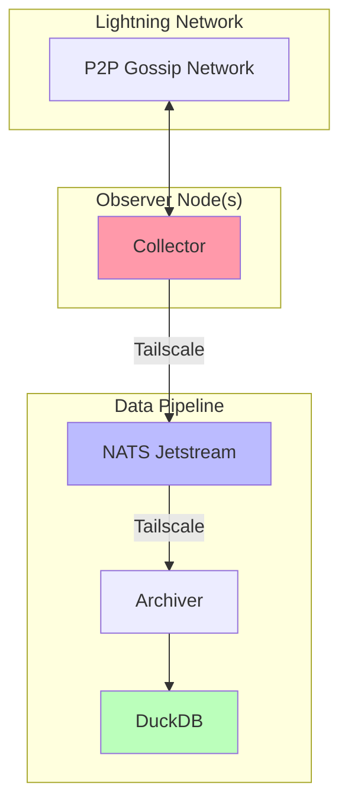

# Gossip Observer

A WIP project to collect LN gossip traffic and compute useful metrics to inform a set-reconciliation based protocol (Erlay-like) to replace message flooding.

## Architecture



- The collector is a daemon that runs a forked version of ldk-node which does not forward gossip
(it should still reply to gossip queries). It collects to a random set of nodes, and then forwards
gossip messages to a NATS server. It runs for a fixed time period, set via config file.

- The archiver applies some basic config to an already-running NATS server, creates a DuckDB database
for storing gossip data from the collector, and batch wrties said data to the DB. The archiver MUST
be started before the collector.

- Tailscale is used as a P2P VPN here due to convinience; Nebula or vanilla Wireguard would also work.

- Once data is collected, the DuckDB built-in UI can be used to run queries:

```bash
./db_build_indices.sh $DB_FILENAME
systemd-run --scope -p MemoryMax=16G -p CPUQuota=50% --user duckdb -ui
```

## Layout

gossip_analyze/ - Small CLI, mostly used to fetch peer specifiers.

gossip_archiver/ - Explained above. Also runs an actix-web server but that is mostly used for debug.

gossip_collector/ - Explained above.

gossip_dump/ - Output dir for lists of node keys, channels, etc.

query_results/ - SQL queries for analysis, CSV output of queries, and chart generators.

Just is used to apply build config for Toki console, though this is only needed for debugging
async issues IMO.

## Results

Check out the presentation or charts in `query_results/`.

## TODOs

- Add some support for using Core Lightning or LND as collectors.
- Update DB write behavior to support receiving duplicate messages from a peer.
- Sort out storage for continuous data collection.
- Sort out scheduled jobs for running analytics.
- How can we detect interesting patterns, without knowing what we're looking for?
